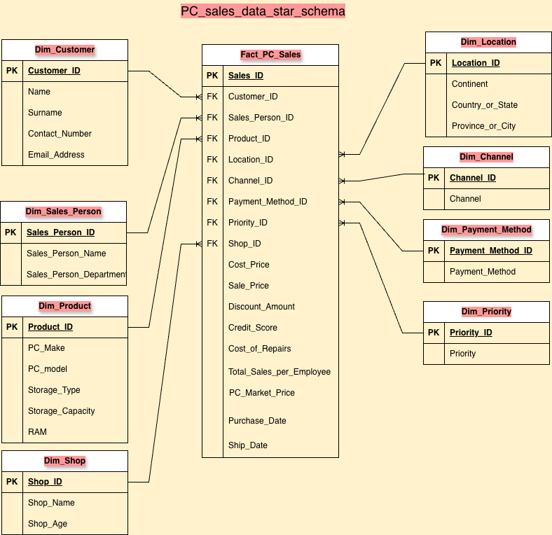

# PC Sales Data Engineering Project

## Business Problem
This project converts a flat retail sales dataset into an analytics-ready data warehouse for PC sales reporting. By building a star schema, the solution supports fast business queries on customers, products, locations, sales channels, payment methods, priority levels, and store performance.

## Data Engineering Objectives
- Ingest raw sales transactions from a single source file.
- Standardize and deduplicate business entities into dimension tables.
- Preserve transaction-level detail in a fact table with foreign key references.
- Apply sound data modeling principles for analytics, scalability, and maintainability.
- Validate the final schema with referential integrity and row-count checks.

## Star Schema Overview
The data model is a classic star schema with one central fact table and eight dimension tables.

- Fact table: `fact_sales`
- Dimensions: `dim_customer`, `dim_product`, `dim_location`, `dim_sales_person`, `dim_shop`, `dim_channel`, `dim_payment_method`, `dim_priority`

The star schema is designed for business reporting and KPI tracking, enabling queries such as:
- Total sales by customer segment
- Sales by product category and region
- Channel and payment method performance
- Priority-level order analysis

### Diagram

## Repository Organization
### `raw_data/`
- `pc_data.csv`
- Source transactional file containing sales events, customer details, product attributes, store location, channel, payment method, and order priority.

### `data_staging/`
- `1. staging_customer_dim.sql`
- `2. staging_location_dim.sql`
- `3. staging_product_dim.sql`
- `4. staging_sales_person_dim.sql`
- `5. staging_shop_dim.sql`
- `6. staging_payment_method_dim.sql`
- `7. staging_priority_dim.sql`
- `8. staging_channel_dim.sql`
- `9. staging_fact_table.sql`
- `updating_tables_with_primary_keys.sql`

These staging scripts:
- build intermediate dimension tables from raw data
- apply cleaning logic to remove inconsistent text formatting
- generate surrogate keys and deduplicate business entities
- populate the fact table using dimension key lookups

### `stored_procedures/`
- `execute_dimension_procedures.sql`
- `sp_create_dim_channel.sql`
- `sp_create_dim_customer.sql`
- `sp_create_dim_location.sql`
- `sp_create_dim_payment_method.sql`
- `sp_create_dim_priority.sql`
- `sp_create_dim_product.sql`
- `sp_create_dim_sales_person.sql`
- `sp_create_dim_shop.sql`
- `sp_create_sales_fact_table.sql`
- `tables_validation.sql`

These stored procedures provide:
- repeatable dimension creation processes
- fact table construction
- final validation and quality checks

### `data_modelling/`
- `pc_sales_data_modelling.png`
- `pc_sales_medallion_architecture.drawio.png`

This folder contains the conceptual design artifacts and architecture diagram for the data pipeline.

## Recommended Execution Flow
1. Load raw data into a staging area.
2. Create or refresh each dimension using the staging scripts or stored procedures.
3. Build the sales fact table after all dimensions are available.
4. Run validation checks in `stored_procedures/tables_validation.sql`.

## Business Value Delivered
- Creates a trusted, centralized view of PC sales activity.
- Enables cross-functional reporting across sales, product, channel, and geography.
- Reduces analytic complexity by standardizing business entities.
- Supports fast ad-hoc analytics and dashboarding with a star schema.

## Notes on Data Modeling Principles
- Raw data is preserved in source files for auditability.
- Staging layers isolate transformation logic from final schema.
- Surrogate keys in dimensions support consistent joins and slowly changing dimension behavior.
- The star schema separates facts from descriptive attributes for performance and clarity.

## How to Use
- Review the SQL files in `data_staging/` for the transformation pipeline.
- Use the stored procedures in `stored_procedures/` to deploy or refresh the model.
- Consult `data_modelling/` diagrams for model structure and architecture.

## How to Run
1. Open your SQL Server environment (SSMS, Azure Data Studio, or equivalent).
2. Load the raw CSV data into a staging table or verify that `pc_data.csv` is accessible to the SQL import process.
3. Run the staging scripts in order:
   - `data_staging/1. staging_customer_dim.sql`
   - `data_staging/2. staging_location_dim.sql`
   - `data_staging/3. staging_product_dim.sql`
   - `data_staging/4. staging_sales_person_dim.sql`
   - `data_staging/5. staging_shop_dim.sql`
   - `data_staging/6. staging_payment_method_dim.sql`
   - `data_staging/7. staging_priority_dim.sql`
   - `data_staging/8. staging_channel_dim.sql`
   - `data_staging/9. staging_fact_table.sql`
4. Apply primary key updates if needed:
   - `data_staging/updating_tables_with_primary_keys.sql`
5. Optionally execute stored procedures to create the same tables via repeatable processes:
   - `stored_procedures/execute_dimension_procedures.sql`
   - `stored_procedures/sp_create_sales_fact_table.sql`
6. Validate the final schema and data quality:
   - `stored_procedures/tables_validation.sql`

> Note: The exact execution commands depend on your SQL toolchain. For SQL Server, use `sqlcmd`, SSMS query windows, or Azure Data Studio notebooks to run these scripts in order.
